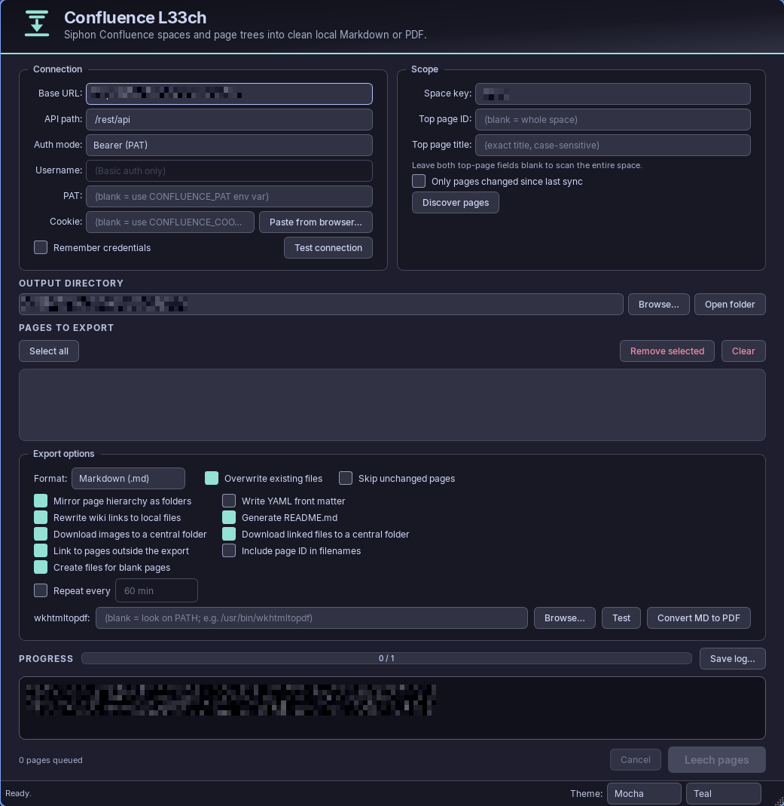

# Confluence L33ch — Catppuccin

A desktop GUI — **Windows and Linux** — that pulls Confluence Server / Data
Center content down to local Markdown or PDF — a whole space, or one page and
everything beneath it — as a single self-contained PySide6 application.

What it does:

1. **Discover, then export.** The page set in scope is listed *before*
   anything is downloaded, so you can review and prune the queue before
   committing to a few hundred requests.
2. **Real storage-format conversion.** Confluence's storage format is XHTML
   with `ac:`/`ri:` macros over it. A proper parser turns tables, code macros,
   nested lists, task lists, admonitions and intra-wiki links into Markdown
   that passes a linter — and reports whatever it had to approximate rather
   than pretending the conversion was lossless.
3. **Incremental by page.** A `.l33ch-state.json` in the output directory
   records each page's last-modified stamp, so a repeat run downloads only
   what actually changed.
4. **Navigable offline.** Links between exported pages are rewritten to point
   at the sibling `.md` files, a `README.md` maps the tree, and optional YAML
   front matter keeps every file traceable to the page it came from.
5. **Credentials stay out of the way.** PAT or session cookie, neither stored
   unless you ask; `CONFLUENCE_PAT` / `CONFLUENCE_COOKIE` work as env-var
   fallbacks so nothing sensitive need touch the settings file.

The UI is themed with [Catppuccin](https://github.com/catppuccin/catppuccin),
defaulting to **Mocha** with a **Teal** accent. All four flavors
(Latte / Frappé / Macchiato / Mocha) plus nine accents are selectable at
runtime from the status-bar dropdowns; the choice persists to `config.json`.

Version 0.1.0. Targets Confluence **Server / Data Center**; Cloud is untested
(see [Known limitations](#known-limitations)).

---

## Install

Requires Python 3.10+. Runtime dependencies are just **PySide6** and
**requests**. Tested on Windows and Linux; nothing in the app is
platform-specific (see [Platform notes](#platform-notes)).

**Windows:**

```powershell
cd C:\Users\<you>\Code\Repo\confluence_l33ch
py -m pip install .
```

**Linux:**

```bash
cd ~/confluence_l33ch
python3 -m pip install .
```

On Debian/Ubuntu, PySide6's Qt platform plugin needs a handful of system
libraries that aren't pulled in by pip — if the app fails to start with an
error about `xcb` or a missing shared library, install them first:

```bash
sudo apt install libxcb-cursor0 libxkbcommon-x11-0 libgl1
```

With the optional local Markdown→PDF support (`markdown` + `pdfkit`):

```bash
python3 -m pip install ".[pdf]"    # py -m pip install ".[pdf]" on Windows
```

Or for development, without installing the package:

```bash
python3 -m pip install -r requirements.txt    # py -m pip install -r requirements.txt on Windows
```

The **Convert MD to PDF** button additionally needs the native
[wkhtmltopdf](https://wkhtmltopdf.org/downloads.html) binary. Everything else
works without it — the **PDF** export *format* asks Confluence for its own
render and involves no local tooling. On Linux, install it with your package
manager (`sudo apt install wkhtmltopdf` on Debian/Ubuntu, `sudo dnf install
wkhtmltopdf` on Fedora) rather than the generic download, so it lands on PATH.

## Run

```bash
confluence-l33ch          # installed entry point (no console window)
python3 -m app.main       # from a checkout
```

```powershell
confluence-l33ch          # installed entry point (no console window), Windows
py -m app.main            # from a checkout, Windows
```

If you have several Python installations, use the one that has PySide6 — e.g.
`py -3.14 -m app.main` on Windows, `python3.13 -m app.main` on Linux.

### Platform notes

The app is built entirely on Qt (PySide6) + `requests`, with no OS-specific
dependency, so the same checkout runs unmodified on Windows and Linux:

* **Settings** live under the OS's standard per-user config location either
  way — see [Configuration](#configuration) for the exact path on each.
* **"Open folder"** uses Windows Explorer, `xdg-open` on Linux, and `open` on
  macOS to reveal the output directory.
* **wkhtmltopdf lookup** checks the field, then `WKHTMLTOPDF_PATH`, then the
  common install locations for every platform (`C:\Program Files\...` and
  also `/usr/bin`, `/usr/local/bin`, `/snap/bin`), then `PATH`.
* Filenames are sanitised against the *Windows*-invalid character set even
  when exporting on Linux — deliberately, so an export folder stays portable
  if it's later copied to or shared with someone on Windows.

Only macOS is untested (though "Open folder" already handles it); file an
issue if something doesn't behave there.

---

## Using the GUI

### 1. Connection

| Field | Notes |
| --- | --- |
| **Base URL** | Your instance root, e.g. `https://confluence.example.com` — **no** `/wiki`, no `/rest/api`. Starts blank; there is no default, and nothing runs until it is set. |
| **API path** | `/rest/api` for most Server/DC installs. Instances behind a context path or reverse proxy need `/wiki/rest/api` or `/confluence/rest/api`. A 404 on every request means this is wrong. |
| **Auth mode** | *Bearer* sends the PAT as `Authorization: Bearer …`. *Basic* sends `username:token` — needed by older instances and by Atlassian Cloud API tokens. |
| **PAT** | Personal Access Token — see [Getting a Personal Access Token](#getting-a-personal-access-token-confluence-server--data-center) below. Blank → the `CONFLUENCE_PAT` environment variable. |
| **Cookie** | A browser session cookie, for SSO-protected instances that redirect PAT requests to a login page. Click **Paste from browser…** to import it — see [Getting the session cookie](#getting-the-session-cookie--click-paste-from-browser) below. Blank → `CONFLUENCE_COOKIE`. |

#### Getting a Personal Access Token (Confluence Server / Data Center)

PATs exist in **Confluence 7.9 and later** (Server and Data Center). On an
older instance the menu entry below simply won't be there — use the **Cookie**
field instead.

1. Log in to Confluence in a browser.
2. Click your **avatar**, top right.
3. Choose **Settings**.
4. In the left sidebar, select **Personal access tokens**.
   *Shortcut:* `https://<your-host>/plugins/personalaccesstokens/manage-tokens.action`
   — prefix it with the context path if your instance has one, e.g.
   `https://<your-host>/confluence/plugins/…`.
5. Select **Create token**.
6. Give it a name (e.g. `confluence-l33ch`), and optionally an **expiry** in
   days. Leaving expiry off creates a non-expiring token — convenient, and
   also the thing your admin most likely wants you not to do.
7. Select **Create**.
8. **Copy the token now.** It is shown exactly once; after you close the
   dialog it cannot be retrieved, only revoked and replaced.

Paste it into the **PAT** field with **Auth mode: Bearer** — the app sends it
as `Authorization: Bearer <token>`, which is what Confluence DC expects.

Things worth knowing before you file a bug against this app:

* **The token carries your own permissions**, no more. If you can't read a
  space in the browser, the token can't either, and discovery returns nothing.
* **Tokens can be switched off server-side.** Admins set
  `-Datlassian.pats.enabled`, cap tokens per user, cap the maximum expiry, and
  can forbid non-expiring tokens; DC admins can also revoke anyone's token at
  any time. A token that worked yesterday and 401s today was probably revoked
  or expired.
* **An expiring token shows `EXPIRES SOON` five days out** in that same
  settings page — worth a glance if you have a scheduled repeat run.
* To revoke: same page, **Revoke** next to the token.

Sources: [Using Personal Access Tokens](https://confluence.atlassian.com/enterprise/using-personal-access-tokens-1026032365.html),
[Confluence 7.9 release notes](https://confluence.atlassian.com/doc/confluence-7-9-release-notes-1026537698.html).

#### Confluence Cloud

Cloud has no PATs. Create an **API token** at
[id.atlassian.com/manage-profile/security/api-tokens](https://id.atlassian.com/manage-profile/security/api-tokens),
then use **Auth mode: Basic** with your **account email** in the *Username*
field and the token in the *PAT* field — Cloud authenticates as
`email:token` over HTTP Basic. Note that this app targets the Server/DC REST
API (`/rest/api`); Cloud's v2 API differs, so treat Cloud as untested rather
than supported.
([Manage API tokens](https://support.atlassian.com/atlassian-account/docs/manage-api-tokens-for-your-atlassian-account/))

#### Getting the session cookie — click **Paste from browser…**

If the PAT gets redirected to an SSO login page (the normal case on a corporate
instance), the app needs a session cookie. The dialog shows the exact URL to
open and walks through the four steps, so nothing here has to be memorised:

1. **Open the probe URL in the browser where you are signed in.** The dialog
   builds it from your Base URL and API path and gives you a **Copy URL**
   button. It is:

   ```text
   https://<your-confluence-host>/rest/api/user/current
   ```

   For example `https://confluence.example.com/rest/api/user/current`, or with
   a context path, `https://confluence.example.com/confluence/rest/api/user/current`.

   That endpoint is deliberate: it is the same one **Test connection** calls, it
   needs no space permissions, and it returns a small JSON object. If you see
   JSON with your account in it, the cookie you are about to copy is genuinely
   authenticated. If you see a login page, sign in and reload before continuing.

2. Press **F12** → the **Network** tab → **reload the page**.
3. Click the **`current`** request in the list on the left — the request list,
   not the Headers panel.
4. Either right-click that request → **Copy** → **Copy as cURL**, or tick the
   **Raw** checkbox next to *Request Headers* and copy the text. Paste it into
   the dialog and click **Use this cookie**.

What the dialog does with it:

* Pulls the `Cookie:` header out of the paste, so there is nothing to select by
  hand and nothing to truncate. It accepts a bash-style or cmd-style `curl`
  command, a raw header block, a single `Cookie: …` line, or just the bare
  `name=value; …` values.
* Fills in **Base URL** from the request URL if you left it blank, preserving a
  context path while dropping the `/rest/api…` suffix.
* Imports the browser's **User-Agent** as well, and reuses it for every request
  made with that cookie. The Confluence response carries `Vary: User-Agent`,
  and a gateway that ties a session to the agent that created it rejects a
  replay under any other one — a 401 indistinguishable from an expired cookie.
* **Warns when the paste contains no session cookie.** `JSESSIONID`,
  `crowd.token_key` and `seraph.confluence` are the ones that prove a login;
  XSRF tokens, analytics IDs and the `NSC_*` load-balancer cookies are present
  on anonymous sessions too, so a paste of only those would authenticate as
  nobody.
* Runs **Test connection** immediately, so you find out at once.

> Cookies are credentials. Anyone holding a `JSESSIONID` can act as you until
> the session ends, so don't paste one into a chat, a ticket or a screenshot —
> and note that signing out of Confluence in the browser is what actually
> invalidates it.

**Fully manual alternative.** DevTools (F12) → **Application** → Storage →
**Cookies** → your host: a table of every cookie including the HttpOnly ones.
Copy the values into the Cookie field directly. Pasting by hand means no
User-Agent is imported, so a UA-bound session may reject it.

> There is no embedded-browser sign-in. An earlier version opened a Chromium
> window and harvested the cookie itself; it was removed because on a machine
> whose Direct3D device gets removed mid-resize it dies inside Chromium's
> swap-chain resize with an uncatchable access violation. A text box cannot
> fail that way.

#### Verifying

**Test connection** calls `/user/current` and tells you who the server thinks
you are. Run it before a large export: it catches wrong API paths, expired
cookies, and — the failure mode that wasted the most time with the old
scripts — a PAT the instance silently ignores, leaving you authenticated as
Anonymous and looking at an empty space.

Credentials are only written to disk when **Remember credentials** is ticked,
and then in plain text. Off by default; leave it off and use the environment
variables if that matters to you.

> **Never put a token or cookie in source control, a code comment, a ticket or
> a chat message.** Pasting a credential into a file "just to test" is how it
> ends up in git history, where it stays after deletion. The `CONFLUENCE_PAT` /
> `CONFLUENCE_COOKIE` environment variables and the off-by-default *Remember
> credentials* checkbox exist so you never have to.

### 2. Scope

Two modes:

* **Subtree** — fill in **Top page ID** (the `pageId` from the page URL) or
  **Top page title**, and the export covers that page plus every descendant,
  found with a CQL `ancestor=` query.
* **Whole space** — leave both top-page fields blank. **Only pages changed
  since last sync** narrows the listing using the timestamp in
  `.l33ch-state.json`.

Click **Discover pages**. Discovery runs on a worker thread with a busy
progress bar; the log reports who the server thinks you are and how many pages
came back per batch. Nothing is downloaded yet — only titles, IDs, timestamps
and ancestry.

The list fills with everything in scope, indented by depth, with a `ROOT` badge
on the subtree root. Hover a row for its page ID, last-modified stamp and path.
**Select all**, **Remove selected** and **Clear** prune the queue; whatever is
left is exactly what gets exported.

Note the asymmetry: **Only pages changed since last sync** applies to *space*
scans, because the filter happens in the listing call. A subtree export always
lists the whole tree — use **Skip unchanged pages** below to avoid
re-downloading their bodies.

### 3. Output directory

**Browse…** picks it; **Open folder** reveals it in the system file manager
(Explorer, or the Linux desktop's default) once it exists (it is created on
the first export). The directory is also where
`.l33ch-state.json`, `README.md` and `l33ch-log.txt` are written, and what
**Convert MD to PDF** reads.

### 4. Export options

| Option | Default | What it does |
| --- | --- | --- |
| **Format** | Markdown | `md` converts the page's storage format locally. `pdf` asks Confluence for its own render (higher fidelity, but many instances have the endpoint disabled). `both` writes one of each. |
| **Overwrite existing files** | on | Off makes a re-run fail on pages already written, rather than replacing them. |
| **Skip unchanged pages** | off | Compares each page's timestamp against `.l33ch-state.json` and skips matches. This is what makes a repeat run cheap. |
| **Mirror page hierarchy as folders** | off | Recreates the parent/child structure as directories instead of writing every page side by side. A page with subpages is written inside its folder as `<folder>_page.md`. Intra-export links are rewritten as relative paths either way. |
| **Write YAML front matter** | off | Prepends title, page ID, space, source URL, version and last-modified stamp, so every file traces back to the page it came from. |
| **Rewrite wiki links to local files** | on | Links between exported pages point at the sibling `.md`. Links out of the export fall back to **Link to pages outside the export** below. |
| **Link to pages outside the export** | on | A link to a page not in this export (a different space, or one you didn't select) points at its live Confluence URL, which needs a logged-in browser session to open. Off renders it as plain text instead — useful for an export you'll share with someone without access, or read offline. |
| **Include page ID in filenames** | on | Names each file `Title_12345.md` instead of just `Title.md`. The ID guarantees a unique, rename-stable filename; off is plainer but relies on titles being unique — two pages that would otherwise land on the same filename (same title, same folder) get a ` (2)`, ` (3)`, … suffix instead of overwriting each other. |
| **Generate README.md** | on | A `README.md` at the output root listing every page, indented by depth. |
| **Download images to a central folder** | off | Fetches *embedded* images into a shared `images/` folder under the output directory and rewrites each `.md` to a relative link, instead of pointing at the live Confluence URL. See [Downloaded images and files](#downloaded-images-and-files). |
| **Download linked files to a central folder** | off | Fetches files a page *links to* (a linked PDF, `.docx`, etc. — not an embedded image) into a shared `files/` folder, independently of the images option. See [Downloaded images and files](#downloaded-images-and-files). |
| **Repeat every** | off, 60 min | Re-runs discovery + export on a timer (1–1440 minutes) so the export tracks the space unattended. Pair it with *Skip unchanged pages*. A scheduled run started while another is in flight is deferred rather than doubled up. |

Then click **Leech pages**. The progress bar counts pages, and per-page
results, skips and conversion caveats stream into the log panel. **Cancel**
stops after the page in flight — workers check the flag between pages, so no
half-written file is left behind.

The closing summary line reads `Done — N exported, M failed, K unchanged`,
plus a trailing `J page(s) had no content of their own (organizational
only)` whenever that applies. That last group is pages Confluence uses purely
to group other pages in the tree — no body of their own, just a title and
children. With **Mirror page hierarchy as folders** on, that title is still
used as the folder those children land in; without it, the page is simply
skipped. Either way it's counted separately from real failures, since there
was never anything to write.

Closing the window cancels any running work and waits up to five seconds for
the threads to stop before exiting.

### 5. Convert MD to PDF *(optional)*

Renders every `.md` under the output directory — recursively, so a mirrored
layout is covered — to a sibling `.pdf` with `markdown` + `pdfkit` +
wkhtmltopdf. Use it when the server's own PDF export is disabled.

* `README.md` is skipped: it is generated navigation, not content.
* **Overwrite existing files** is honoured here too, so an unticked box skips
  PDFs that already exist.
* A print stylesheet is applied (neutral serif-free typography, ruled tables,
  boxed code, 16–18 mm margins) — bare HTML renders as unstyled Times New
  Roman with unruled tables.
* **Test** reports the resolved binary path and its version, so you find out
  before a batch whether the path is right.
* Lookup order for the binary: the field, then `WKHTMLTOPDF_PATH`, then the
  default install locations for Windows/Linux/macOS, then `PATH`.

---

## Output layout

Flat (default):

```text
<output>/
  README.md
  .l33ch-state.json
  l33ch-log.txt
  Release Notes_123456.md
  Getting Started_123457.md
```

Mirrored (**Mirror page hierarchy** on):

```text
<output>/
  README.md
  l33ch-log.txt
  Product Docs/
    Product Docs_page.md
    Getting Started/
      Getting Started_page.md
      Install_102.md
```

A page that has subpages becomes a folder, and its own content is written
inside that folder as `<folder>_page.md` (no page ID — the folder already
makes the name unique), so each folder is self-contained. Pages without
subpages keep the normal filename scheme below.

`l33ch-log.txt` always sits at the output root (never inside a mirrored
subfolder) — see [`l33ch-log.txt`](#l33ch-logtxt) below.

Filenames are `<sanitised title>_<page id>.<ext>`. The page ID makes them
unique and stable across renames, and the whole scheme is deterministic, so an
incremental run over an existing export folder lands on the same files.
Sanitising replaces the Windows-invalid
characters and control chars with `_`, collapses repeats, trims leading and
trailing dots and spaces, and caps the name at 180 characters so directory +
name stays under `MAX_PATH`.

With **Include page ID in filenames** off, the ID is dropped and the file is
just `<sanitised title>.<ext>`. Two pages that would otherwise collide (same
title, same folder) get a ` (2)`, ` (3)`, … suffix based on their order in
the page list, rather than one silently overwriting the other.

### Downloaded images and files

Two independent options, off by default, cover the two ways a page can
reference an attachment:

* **Download images to a central folder** — *embedded* images (`ac:image`)
  land in a shared `images/` folder.
* **Download linked files to a central folder** — files a page merely
  *links* to (`ac:link` to an attachment — a PDF, `.docx`, spreadsheet, etc.,
  not rendered inline) land in a shared `files/` folder.

Either one (or both) produces a layout like this at the output root,
regardless of **Mirror page hierarchy**:

```text
<output>/
  README.md
  images/
    123457_diagram.png
    123457_screenshot.png
  files/
    123457_handbook.pdf
  Getting Started_123457.md
```

Each file is named `<page id>_<attachment filename>` so two pages that both
have a `diagram.png` don't collide, and the `.md` links to it with a path
relative to its own location — `images/123457_diagram.png` from a flat
layout, `../images/123457_diagram.png` from one level into a mirrored tree
(and the same shape for `files/`). A file already present is reused rather
than re-fetched unless **Overwrite existing files** is on. If a particular
download fails (permissions, a deleted attachment), that one reference falls
back to the live Confluence link and the log says so — it doesn't fail the
whole page.

With both options off (the default), images and file attachments are left
pointing at `/download/attachments/<pageId>/<file>` on the server, which
resolves for anyone with a logged-in browser session but nothing is fetched
locally.

### Front matter

With **Write YAML front matter** ticked (off by default), each `.md` starts with:

```yaml
---
title: "Getting Started"
page_id: "123457"
space: "DOCS"
source: https://confluence.example.com/pages/viewpage.action?pageId=123457
updated: 2025-01-02T03:04:05.000+01:00
version: 7
exported_by: confluence-l33ch 0.1.0
---
```

`source` uses `viewpage.action?pageId=…`, which resolves on every Server/DC
instance regardless of space or title changes. Double quotes in a title are
downgraded to single quotes so the YAML scalar stays valid.

### `README.md`

```markdown
# DOCS export

42 page(s) exported by confluence-l33ch 0.1.0 on 2025-01-02T03:04+01:00.

- [Product Docs](Product%20Docs_100.md)
  - [Getting Started](Product%20Docs/Getting%20Started_101.md)
    - [Install](Product%20Docs/Getting%20Started/Install_102.md)
```

Indentation follows each page's depth, and paths are URL-encoded so spaces
don't break the links. It is only written for Markdown runs — a PDF-only
export has nothing to index.

### `.l33ch-state.json`

```json
{
  "last_sync": "2025-01-02T03:04:05+01:00",
  "pages": {
    "123456": "2025-01-01T09:00:00.000+01:00"
  },
  "space_key": "DOCS"
}
```

`pages` maps page ID → the last-modified stamp at the time it was exported;
that is what **Skip unchanged pages** compares against. `last_sync` is what
**Only pages changed since last sync** feeds into the space listing. Delete the
file to force a full re-export.

### `l33ch-log.txt`

Every line that reaches the log panel during an export or **Convert MD to
PDF** run is also mirrored to `l33ch-log.txt` at the output root — the exact
same text, written as it happens. It's overwritten at the start of each run
(a "last run" record, not an ever-growing history), which matters for large
spaces or a scheduled **Repeat every** run: the log panel itself isn't
practical to scroll or copy from at thousands of lines, but the file is
`grep`-able:

```bash
grep "Could not download" l33ch-log.txt
```

Independently, the **Save log…** button (next to the progress bar) saves
*everything currently in the log panel* — including connection tests,
discovery, and every run since the app was opened, not just the last one —
to a file of your choosing.

---

## Conversion fidelity

The Markdown path parses the storage format with `html.parser` (stdlib only —
no BeautifulSoup dependency) and handles:

* headings, paragraphs, hard line breaks, horizontal rules, blockquotes
* `strong` / `em` / `code` / `del` / `sup` / `sub`
* nested ordered and unordered lists, and `ac:task-list` → `- [x]` / `- [ ]`
* tables with or without a header row; multi-line cells are joined with
  `<br>` and pipes escaped
* `code` / `noformat` macros → fenced blocks, with the language parameter
* the admonition family (`info`, `note`, `tip`, `warning`, `panel`, `error`,
  `success`) → blockquotes with a bold label
* `expand`, `status`, `jira`, and layout-only wrappers (`excerpt`, `section`,
  `column`, `align`, …) which contribute their content and drop the wrapper
* `ac:link` to other pages, resolved to a local file when that page is part
  of the export; a link with no body falls back to the target's title
* `ac:image` with `ri:attachment` or `ri:url`, plus plain ``
* `ac:emoticon` → the equivalent emoji, and `<time datetime="…">` → the date
* malformed markup, without raising — unbalanced tags are flushed rather than
  aborting the page

Output is normalised on the way out: trailing whitespace stripped except the
deliberate two-space hard break, runs of blank lines collapsed, nested lists
kept tight rather than loose. That is the same set of markdownlint rules
(MD009/MD012/MD047) a Markdown linter would otherwise flag.

Things it deliberately does **not** do, and says so in the log:

* **Attachments are not downloaded by default.** Image and file references
  point at `/download/attachments/<pageId>/<file>` on the server, which
  resolves for anyone with a logged-in browser session. A dead relative link
  to a file that was never fetched would be worse. Tick **Download images to
  a central folder** and/or **Download linked files to a central folder** to
  fetch them instead — see [Downloaded images and
  files](#downloaded-images-and-files).
* **Navigation macros are dropped** — `toc`, `children`, `pagetree`,
  `livesearch` and friends. The exported tree and `README.md` are the
  navigation.
* **Unrecognised macros pass their body through** rather than being deleted,
  and their names are listed at the end of the run so you know the output is
  an approximation there.

---

## Configuration

Settings auto-save 500 ms after any change to:

```text
%LOCALAPPDATA%\ConfluenceL33ch\ConfluenceL33ch\config.json      (Windows)
~/.config/ConfluenceL33ch/ConfluenceL33ch/config.json           (Linux)
```

The Linux path honours `$XDG_CONFIG_HOME` if it's set. The path is printed in
the log panel at startup. A missing or corrupt file is
not an error — the app starts with its defaults and the next save rewrites it
cleanly. Writes go to a temporary file and are moved into place, so an
interrupted write cannot leave a config that fails to parse.

Everything on the form is persisted — connection, scope, output directory,
every option, the repeat interval, and the theme — **except** the PAT and
cookie, which are written only when **Remember credentials** is ticked, and
then in plain text. Un-ticking the box erases them from the file on the next
save, because the config is rebuilt from scratch each time rather than merged.

Nothing site-specific is baked into the source: there is no default instance
URL, space key or credential anywhere in the code. `config.json` lives under
the OS's per-user config directory (above), and exported content plus
`.l33ch-state.json` land in whichever output directory you choose — none of
it inside the checkout. Point the tool at your own instance and nothing about
anyone else's comes with it.

Environment variables, all optional and used only as fallbacks when the
corresponding field is blank:

| Variable | Used for |
| --- | --- |
| `CONFLUENCE_PAT` | Personal Access Token |
| `CONFLUENCE_COOKIE` | Session cookie header value |
| `WKHTMLTOPDF_PATH` | wkhtmltopdf binary location |

---

## Known limitations

* **Attachments are not downloaded unless you turn it on.** By default,
  references point at the server; see *Conversion fidelity* and *Downloaded
  images*.
* **macOS is untested.** "Open folder" already has an `open`-based branch for
  it, but nothing else has been run there.
* **Confluence Cloud is untested.** The client targets the Server/DC REST API.
  Basic auth with an email + API token may work for simple cases, but Cloud's
  v2 API differs and nothing here is verified against it.
* **Server-side PDF export is often disabled.** Six endpoints are tried and the
  log lists every attempt; if they all 403/404, use Markdown plus
  **Convert MD to PDF**.
* **A cookie is a poor credential for a scheduled run.** Sessions expire, and a
  **Repeat every** cycle will start failing silently mid-schedule. Use a PAT if
  you want unattended runs.
* **Page titles are the link key.** Intra-wiki links resolve by title because
  that is what the storage format records. Titles are unique per space, so this
  is sound within one space, but a link into a *different* space keeps its
  Confluence URL rather than resolving locally.
* **No embedded browser.** Removed after it proved able to take the process
  down on hardware whose Direct3D device gets removed; see the cookie section.

---

## Architecture

```text
app/
  main.py               entry point: QApplication, theme, MainWindow
  main_window.py        all UI construction, slots, settings persistence
  theme.py              Catppuccin palettes, QPalette + QSS, hero mark
  config.py             JSON settings under QStandardPaths, atomic writes
  confluence_client.py  REST: auth headers, pagination, CQL, PDF export
  cookie_import.py      paste-a-request cookie import + probe URL
  discovery.py          worker that resolves scope → list[PageRef]
  storage_converter.py  storage format → Markdown (html.parser)
  worker.py             export worker: paths, links, front matter, state, index
  md_to_pdf.py          local Markdown → PDF via markdown + pdfkit
tests/
  test_cookie_import.py       cURL / header paste parsing, probe URL
  test_thread_lifecycle.py    worker-thread ownership regressions
  test_config.py              settings persistence, atomic writes
  test_confluence_client.py   header building, ancestry → depth, PDF URLs
  test_discovery.py           subtree vs space scope, error propagation
  test_export_worker.py       full run against a stubbed client
  test_storage_converter.py   every storage-format construct
  test_worker_paths.py        filenames, mirrored layout, link rewriting
```

Every long operation is a `QObject` worker with `progress` / `log` /
`finished` signals, moved onto a fresh `QThread` by `worker.run_in_thread` —
so the UI never blocks and cancellation is a flag check between pages.

**`run_in_thread` owns both the thread and the worker** until the thread
finishes, and that is deliberate. `moveToThread` confers no ownership, and the
`started → worker.run` connection does not keep the worker alive, so a worker
whose caller held no reference was collected before it ever ran. Symmetrically,
a caller clearing `self._thread = None` inside its own `finished` handler —
which runs *before* `thread.quit()` takes effect — dropped the last reference to
a still-running `QThread` and aborted the process with
`QThread: Destroyed while thread '' is still running`. Central ownership makes
callers' bookkeeping irrelevant; `wait_for_threads()` covers the same hazard at
shutdown.

`ConfluenceClient` raises `ConfluenceError` with messages written for a human;
the GUI puts them straight in the log panel rather than translating them. The
JSON-vs-HTML content-type check matters more than it looks: an SSO-protected
instance answers unauthenticated REST calls with `200` and a login page, so
`raise_for_status()` passes and `.json()` then fails with something opaque.

### Tests

```bash
python3 -m pip install pytest
python3 -m pytest tests -q
```

```powershell
py -m pip install pytest
py -m pytest tests -q
```

147 tests cover the storage converter (every construct, plus malformed markup),
the client's header building and ancestry→depth maths, cURL/header paste
parsing and the probe URL, scope resolution and its error paths, the export
worker's filename/link/front-matter logic (including the central image/file
download paths), a full export run against a stubbed REST client (formats,
incremental skip, mirrored layout, cancellation), and
settings persistence, and worker-thread ownership. The thread tests abort the run rather than fail an
assertion if they regress — that is the nature of the bug they guard.

Live HTTP is not exercised; **Test connection** is the manual equivalent.

---

## Troubleshooting

| Symptom | Cause |
| --- | --- |
| *"Expected JSON … got text/html"* | An SSO login redirect. Paste a session cookie, or fix the API path. |
| HTTP 404 on every request | Wrong **API path**. Try `/wiki/rest/api` or `/confluence/rest/api`. |
| Discovery returns 0 pages | The server sees you as Anonymous — run **Test connection**. Or the space key is wrong. |
| *"The server accepted the request but treats you as Anonymous"* | The instance ignores PATs on REST. Use a session cookie, or switch to Basic auth with your username. |
| HTTP 401 on a token that worked before | Expired or revoked. Check **Settings → Personal access tokens**; admins can revoke anyone's token and cap expiry. |
| No **Personal access tokens** entry in Settings | Confluence older than 7.9, or an admin has set `-Datlassian.pats.enabled=false`. Use **Paste from browser…** to import a cookie instead. |
| `QThread: Destroyed while thread '' is still running` | Fixed: threads and their workers are owned centrally in `worker.py` instead of by whichever handler cleared its reference first. A recurrence would be a regression in `run_in_thread` — `tests/test_thread_lifecycle.py` guards it. |
| Cookie imported, then 401 a minute later | Some gateways issue a short-lived session, or the instance invalidated it. Re-import via **Paste from browser…**; if it keeps happening, a PAT is the more durable credential. |
| Every PDF export fails | The instance has PDF export disabled. Export Markdown and use **Convert MD to PDF**. |
| Pages export but are nearly empty | The account can list the page but not read its body — a permission problem, not a converter bug. |
| `wkhtmltopdf not found` | Install it (`apt install wkhtmltopdf` on Linux, the installer from wkhtmltopdf.org on Windows) and either add its `bin`/install folder to PATH or point the field at the binary directly. |
| App won't start on Linux: missing `xcb`/`libGL` etc. | Install the Qt platform-plugin system libraries — see *Install* above (`libxcb-cursor0 libxkbcommon-x11-0 libgl1` on Debian/Ubuntu). |
| *"Could not resolve the top page"* | On Server/DC page IDs are **numeric** — take the `pageId=` value from the page's URL. A short-link or Cloud-style ID will not resolve. Or clear the ID and use **Top page title**, which must match exactly, including case. |
| `Missing dependency: pdfkit` / `markdown` | Install the optional extra: `py -m pip install ".[pdf]"`. |
| Export writes files but `README.md` is absent | Expected for a PDF-only run, or with **Generate README.md** unticked. |
| A repeat schedule stops producing anything | Almost always an expired cookie. Check the log for 401s and re-import, or switch to a PAT. |
| "N image(s)/file(s) could not be downloaded" | Check `l33ch-log.txt` in the output directory (or the **Save log…** button) for the specific `! Could not download …` line per attachment — it carries the real HTTP status. 401/403 usually means the download endpoint doesn't accept the same auth as the REST API; 404 means the attachment/page no longer matches; 429 means you were rate-limited on a large export. |

---

## License

MIT — see [LICENSE](LICENSE).

## Theme

[Catppuccin](https://github.com/catppuccin/catppuccin) is MIT-licensed. Colours
are assigned by semantic role (Base, Surface, Text, Accent…), never by hex
code, so a flavor switch preserves the contrast hierarchy automatically. The
log panel is the one deliberate deviation: it stays Crust + Green in every
flavor, because a terminal panel is its own subgenre.
